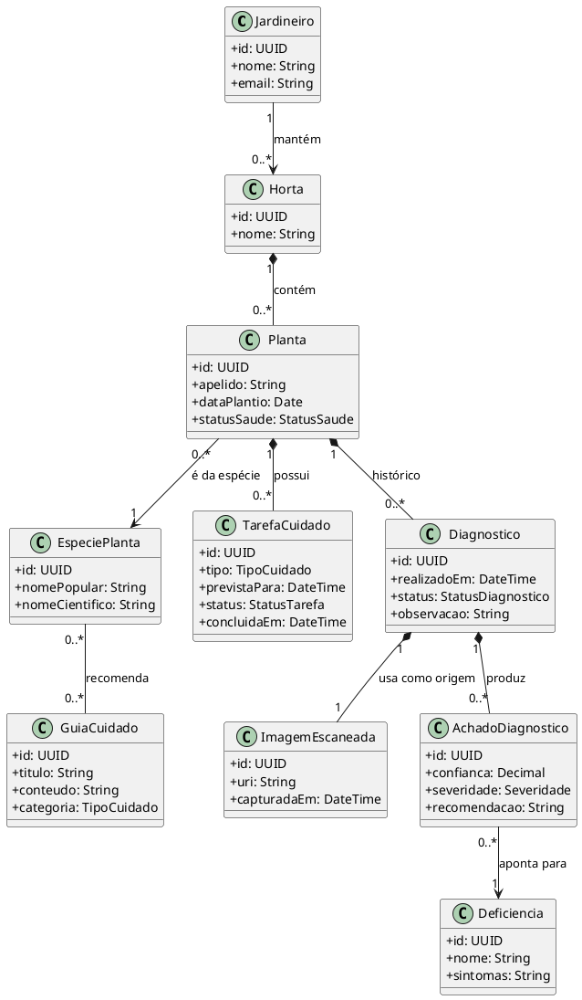

# Diagrama de classes - Horta

O diagrama apresenta as entidades centrais da horta e suas multiplicidades: jardineiro, horta, planta, espécie, tarefas de cuidado, diagnósticos e deficiências.

```plantuml
@startuml
skinparam classAttributeIconSize 0

class Jardineiro {
  +id: UUID
  +nome: String
  +email: String
}
class Horta {
  +id: UUID
  +nome: String
}
class Planta {
  +id: UUID
  +apelido: String
  +dataPlantio: Date
  +statusSaude: StatusSaude
}
class EspeciePlanta {
  +id: UUID
  +nomePopular: String
  +nomeCientifico: String
}
class TarefaCuidado {
  +id: UUID
  +tipo: TipoCuidado
  +previstaPara: DateTime
  +status: StatusTarefa
  +concluidaEm: DateTime
}
class GuiaCuidado {
  +id: UUID
  +titulo: String
  +conteudo: String
  +categoria: TipoCuidado
}
class Diagnostico {
  +id: UUID
  +realizadoEm: DateTime
  +status: StatusDiagnostico
  +observacao: String
}
class ImagemEscaneada {
  +id: UUID
  +uri: String
  +capturadaEm: DateTime
}
class AchadoDiagnostico {
  +id: UUID
  +confianca: Decimal
  +severidade: Severidade
  +recomendacao: String
}
class Deficiencia {
  +id: UUID
  +nome: String
  +sintomas: String
}

Jardineiro "1" --> "0..*" Horta : mantém
Horta "1" *-- "0..*" Planta : contém
Planta "0..*" --> "1" EspeciePlanta : é da espécie
Planta "1" *-- "0..*" TarefaCuidado : possui
Planta "1" *-- "0..*" Diagnostico : histórico
Diagnostico "1" *-- "1" ImagemEscaneada : usa como origem
Diagnostico "1" *-- "0..*" AchadoDiagnostico : produz
AchadoDiagnostico "0..*" --> "1" Deficiencia : aponta para
EspeciePlanta "0..*" -- "0..*" GuiaCuidado : recomenda
@enduml
```
