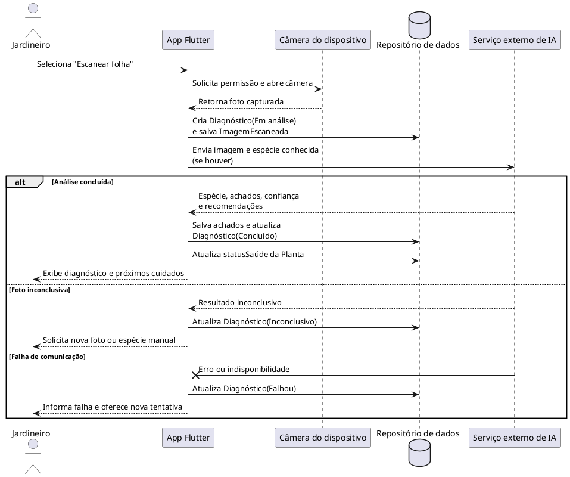

# Diagrama de sequência - Diagnóstico com serviço externo

> Este fluxo representa a integração necessária para substituir a simulação atual do scanner por análise real de imagem.

```plantuml
@startuml
actor Jardineiro as J
participant "App Flutter" as App
participant "Câmera do dispositivo" as Cam
database "Repositório de dados" as Repo
participant "Serviço externo de IA" as IA

J -> App: Seleciona "Escanear folha"
App -> Cam: Solicita permissão e abre câmera
Cam --> App: Retorna foto capturada
App -> Repo: Cria Diagnóstico(Em análise)\ne salva ImagemEscaneada
App -> IA: Envia imagem e espécie conhecida\n(se houver)

alt Análise concluída
  IA --> App: Espécie, achados, confiança\ne recomendações
  App -> Repo: Salva achados e atualiza\nDiagnóstico(Concluído)
  App -> Repo: Atualiza statusSaúde da Planta
  App --> J: Exibe diagnóstico e próximos cuidados
else Foto inconclusiva
  IA --> App: Resultado inconclusivo
  App -> Repo: Atualiza Diagnóstico(Inconclusivo)
  App --> J: Solicita nova foto ou espécie manual
else Falha de comunicação
  IA -x App: Erro ou indisponibilidade
  App -> Repo: Atualiza Diagnóstico(Falhou)
  App --> J: Informa falha e oferece nova tentativa
end
@enduml
```
