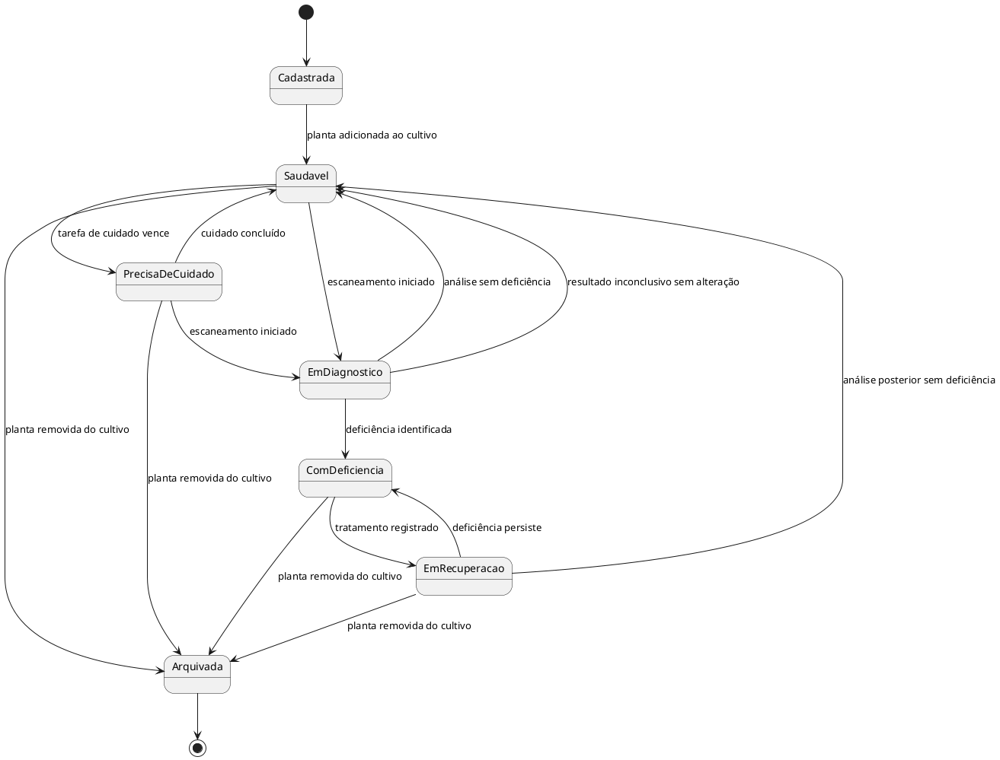

# Diagrama de estados - Planta

```plantuml
@startuml
[*] --> Cadastrada
Cadastrada --> Saudavel : planta adicionada ao cultivo
Saudavel --> PrecisaDeCuidado : tarefa de cuidado vence
PrecisaDeCuidado --> Saudavel : cuidado concluído

Saudavel --> EmDiagnostico : escaneamento iniciado
PrecisaDeCuidado --> EmDiagnostico : escaneamento iniciado
EmDiagnostico --> Saudavel : análise sem deficiência
EmDiagnostico --> Saudavel : resultado inconclusivo sem alteração
EmDiagnostico --> ComDeficiencia : deficiência identificada

ComDeficiencia --> EmRecuperacao : tratamento registrado
EmRecuperacao --> Saudavel : análise posterior sem deficiência
EmRecuperacao --> ComDeficiencia : deficiência persiste

Saudavel --> Arquivada : planta removida do cultivo
PrecisaDeCuidado --> Arquivada : planta removida do cultivo
ComDeficiencia --> Arquivada : planta removida do cultivo
EmRecuperacao --> Arquivada : planta removida do cultivo
Arquivada --> [*]
@enduml
```
